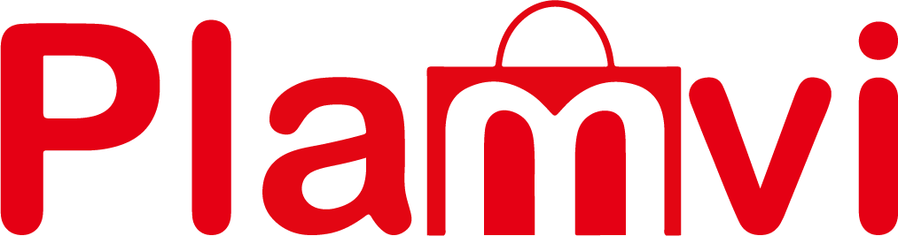

<h1 align="center">
    
</h1>

<p align="center">
  

  
	
  <a href="https://www.linkedin.com/in/gabriel-orlando-07266a117/">
    
  </a>

  <a href="https://github.com/index325/Plamvi_APP/commits/master">
    
  </a>
   <a href="https://github.com/index325/Plamvi_APP/stargazers">
    
  </a>
</p>

## :information_source: O que é o Plamvi?

Plamvi é um aplicativo que foi desenvolvido pensando em ajudar as pessoas a realizarem suas compras em mercados de sua cidade.
Tudo isso de forma prática, rápida e segura.

## 💻 O projeto

O projeto foi desenvolvido como um trabalho de conclusão de curso. No grupo constam os integrantes:
- Eu: Gabriel Orlando, o programador do projeto.
- E o Guilherme Azevedo, que ajudou na monografia e na documentação do projeto.

<h1 align="center">
    
</h1>


## :rocket: Tecnologias

Este projeto foi construído utilizando as seguintes tecnologias:

- React Native
- Expo
- TypeScript

## :information_source: Como utilizar

Para clonar e rodar esta aplicação, você precisará do [Git](https://git-scm.com), [Node.js](https://nodejs.org/en/) instalados em seu computador.

Então, você deverá rodar os seguintes comandos:

### Abra o terminal

```bash
# Clone este repositório
$ git clone https://github.com/index325/Plamvi_APP.git

# Entre no diretório criado
$ cd Plamvi_APP

# Instale as dependências
$ npm install

# Execute o expo
$ expo start

```

Após isso, é só ter o app do Expo instalado em seu celular, ler o QR Code e aguardar o projeto abrir.

##OBS: No momento, a API não está em nenhum serviço de hospedagem, portanto ela deverá estar rodando em seu computador também!

Para acessar o repositório da api, [clique aqui](https://github.com/index325/Plamvi_Node)

Feito com ♥ por Gabriel Orlando :wave: [Me siga no LinkedIn!](https://www.linkedin.com/in/gabriel-orlando-07266a117/)
